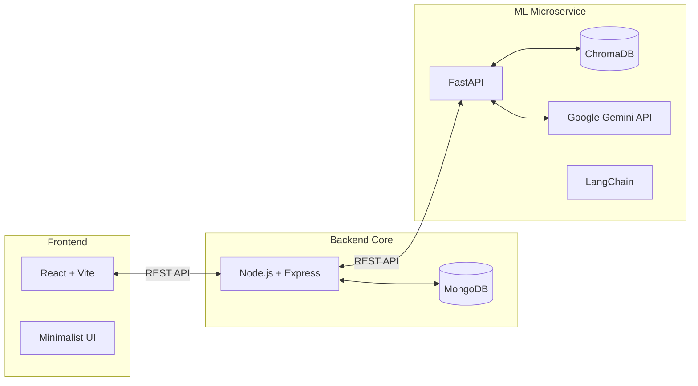

# AI Research Workspace 🧠

An intelligent, full-stack research platform that allows users to upload PDF research papers and interact with them using a context-aware, branched Q&A system. 

Built with a Node.js/Express backend, a React frontend, and a FastAPI machine learning microservice running LangChain, Gemini 2.5 Flash, and ChromaDB.

## 🚀 Features

- **Branched Conversation Trees:** Inspired by ChatGPT's branching, users can split off from any point in a conversation to explore a different line of thought without polluting the original context.
- **RAG-Powered Q&A:** Uploaded PDFs are instantly parsed, chunked, and embedded into a local ChromaDB vector store.
- **Context Isolation:** Advanced MongoDB schema design ensures that when you branch a chat, the new branch inherits the history only up to that point. 
- **Professional Minimalist UI:** Built with raw CSS variables and Lucide React icons for a fast, utility-first SaaS aesthetic.
- **Secure Authentication:** JWT-based user authentication and route protection.

---

## 🏗️ Architecture



---

## 🛠️ Tech Stack

- **Frontend:** React 19, Vite, React Router, Lucide React
- **Backend:** Node.js, Express, MongoDB, Mongoose, JSON Web Tokens (JWT)
- **ML Service:** Python, FastAPI, Uvicorn, LangChain, PyPDF2
- **AI / Vector Store:** Google Gemini 2.5 Flash API, ChromaDB

---

## 🧗‍♂️ Engineering Challenges & How We Solved Them

Building a tree-based chat interface with persistent, isolated context is significantly harder than building a linear chat app. Here are some of the toughest hurdles we faced and how we solved them:

### 1. The "Ghost Context" Branching Problem
**The Problem:** Initially, when a user branched a conversation, we just copied the message array into a new document. However, if they asked a question in Branch A, the LLM wouldn't remember the context of the parent branch, or worse, it would hallucinate context from sibling branches.
**The Fix:** We redesigned the MongoDB schema to use a `rootId` and `parentId` tree structure. When a new branch is created, the backend dynamically traverses the tree to build an inherited message history. To keep the UI clean, we implemented a "Copy-on-Branch" strategy with an `isHidden` flag—so the LLM sees the full history, but the user only sees their fresh, branch-specific messages.

### 2. React Infinite Loops During Deletion Cascades
**The Problem:** Deleting a root chat requires cascading deletes of all its nested branches. When this happened, our `Sidebar.jsx` and `ChatPanel.jsx` components would get caught in an infinite re-render loop trying to fetch a deleted `activeConversationId`.
**The Fix:** We implemented a rigorous fallback heuristic. We patched the React `useEffect` dependency arrays and added logic to automatically traverse up the tree to select the `parentId` if the active branch is deleted, or gracefully fallback to a `null` state if the entire tree is wiped, completely stabilizing the UI.

### 3. Duplicate Key Errors (MongoDB Indexing)
**The Problem:** During the integration of the conversation schema, the backend suddenly started crashing with `E11000 duplicate key error`. MongoDB was trying to enforce a unique index on `[paperId, userId]` that had been accidentally created during an earlier iteration, which prevented users from having more than one chat per paper.
**The Fix:** We wrote a custom migration script to drop the hidden unique index directly from the MongoDB collection, allowing a 1-to-N relationship between papers and conversation trees.

### 4. Asynchronous PDF Processing Blocking the Event Loop
**The Problem:** Passing large research papers (PDFs) from the Node backend to the Python ML service initially caused timeouts because we were waiting synchronously for PyPDF2 and ChromaDB to finish chunking and embedding before returning a 200 OK to the client.
**The Fix:** We decoupled the architecture. The Node.js server now uploads the file, saves the metadata to MongoDB, and immediately responds to the client so the UI feels snappy. The Python ML service handles the heavy lifting (embedding and vectorization) asynchronously.

---

## 💻 Local Setup Instructions

### 1. Clone the repository
```bash
git clone https://github.com/abhinavsingh-28/ai-research-workspace.git
cd ai-research-workspace
```

### 2. Set up the Node Backend
```bash
cd server
npm install
```
Create a `.env` file in the `/server` directory:
```env
PORT=5001
MONGODB_URI=mongodb://localhost:27017/ai_research_db
JWT_SECRET=your_super_secret_jwt_key
ML_SERVICE_URL=http://localhost:8000
```
Run the backend:
```bash
npm run dev
```

### 3. Set up the React Frontend
```bash
cd client
npm install
npm run dev
```

### 4. Set up the Python ML Service
```bash
cd ml-service
python3 -m venv venv
source venv/bin/activate
pip install -r requirements.txt
```
Create a `.env` file in the `/ml-service` directory:
```env
GEMINI_API_KEY=your_google_gemini_api_key
```
Run the ML service:
```bash
uvicorn main:app --reload --port 8000
```

---

*Designed and engineered as a modern, AI-native SaaS application.*
